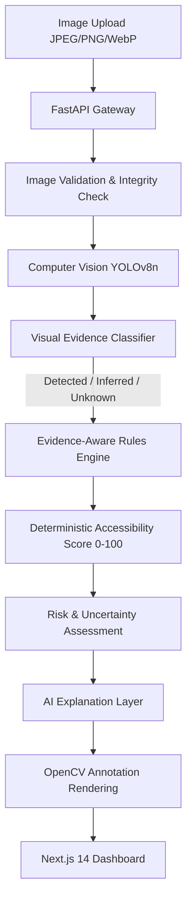

# WAYFIND AI — System Architecture (Day 2 Final)

## Overview
WAYFIND AI converts ordinary camera imagery of streets, pathways, and entrances into structured, evidence-based accessibility intelligence.
Rather than delegating scoring to a non-deterministic black-box LLM, WAYFIND utilizes a deterministic computer vision + evidence extraction + rules engine pipeline.

---

## 1. Pipeline Stages

### Stage 1: Ingestion & Validation
- Validates image headers, payload sizes (capped at 10MB), and format integrity using Pillow.
- Rejects malformed payloads with structured HTTP status codes.

### Stage 2: Visual Perception & Feature Extraction
- **YOLOv8n Model**: Pretrained lightweight object detection running in sub-200ms on CPU.
- Extracts bounding box coordinates $[x_1, y_1, x_2, y_2]$ and class confidences for recognized entities.

### Stage 3: Structured Evidence Categorization
Separates visual reality into three explicit categories:
1. **Positively Detected**: Objects localized in the camera view (stairs, obstacles, vehicles).
2. **Contextually Inferred**: Spatial conclusions drawn from surrounding conditions (e.g. navigable corridor width).
3. **Explicitly Unknown**: Infrastructure concepts unobservable from a single 2D monocular frame (e.g. ADA ramp slope grade, tactile paving, automatic door openers).

### Stage 4: Deterministic Scoring Formulation
The accessibility score $S \in [0, 100]$ is computed as:

$$S = \text{clamp}\left(100 - \sum P_{\text{barriers}} + \sum R_{\text{accessible}}, 0, 100\right)$$

Where:
- $P_{\text{stairs}} = \min(25 \times N_{\text{stairs}}, 50)$
- $P_{\text{obstacle}} = \min(10 \times N_{\text{obstacle}}, 30)$
- $P_{\text{vehicle}} = \min(15 \times N_{\text{vehicle}}, 30)$
- $P_{\text{crowd}} = 5 \quad \text{if } N_{\text{person}} > 4 \text{ else } 0$
- $R_{\text{ramp}} = 15 \times N_{\text{ramp}}$
- $R_{\text{clear}} = 10 \quad \text{if no physical barriers detected}$

**Responsible AI Principle**: An unobserved feature (such as an unconfirmed ramp) receives $0$ penalty points. Absence of visual evidence does not constitute evidence of physical absence.

### Stage 5: Classification Tiers
- **Fully Accessible**: Score $\ge 90$
- **Mostly Accessible**: $70 \le \text{Score} < 90$
- **Partially Accessible**: $40 \le \text{Score} < 70$
- **Limited Accessibility**: $\text{Score} < 40$

### Stage 6: Explanation & Visualization Layer
- High-contrast OpenCV rendering overlaying category-specific bounding boxes.
- Natural language insight generated via pluggable `ExplanationProvider` (Deterministic fallback + optional Gemini/OpenAI synthesis).
