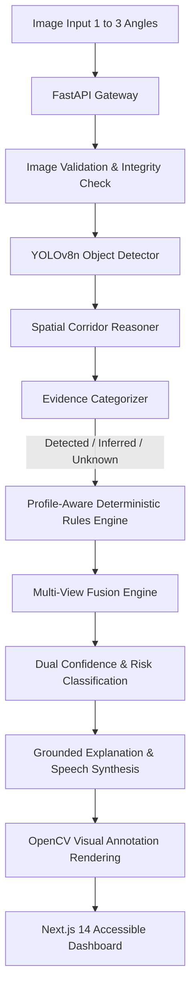

# WAYFIND AI — System Architecture (Final Pass)

## Overview
WAYFIND AI transforms ordinary camera imagery of streets, pathways, and entrances into structured, evidence-based accessibility intelligence.
Rather than delegating scoring to a non-deterministic black-box LLM, WAYFIND utilizes a deterministic computer vision + spatial corridor reasoning + mobility profile rules engine pipeline.

---

## 1. End-to-End Pipeline Stages

### Stage 1: Ingestion & Multi-View Ingestion
- Accepts 1 to 3 complementary camera perspectives (`approach`, `entrance`, `side path`).
- Validates file formats (JPEG, PNG, WebP) and 10MB payload size limits using Pillow.

### Stage 2: Visual Perception & Feature Extraction
- **YOLOv8n Model**: Lightweight convolutional detector operating in sub-200ms on CPU.
- Generates 2D bounding boxes $B = [x_1, y_1, x_2, y_2]$ with detection confidences for native COCO classes (`chair`, `bench`, `vehicle`, `person`).

### Stage 3: Spatial Corridor Reasoning
- Infers ground plane ($y \ge 0.45h$) and central pedestrian navigation corridor ($0.20w \le x \le 0.80w$).
- Classifies objects into:
  - `corridor_obstruction`: Direct blockage on central travel path (overlap $\ge 30\%$).
  - `pathway_restriction`: Sidewalk pinch point along corridor edges ($0.50\times$ penalty).
  - `contextual_outside_corridor`: Objects on road or verge (**0 points penalty**).

### Stage 4: Profile-Aware Deterministic Rules Engine
- Evaluates constraints across 5 mobility personas (`wheelchair`, `walker`, `stroller`, `low_vision`, `general_mobility`).
- Mathematical formulation:
  $$S = \text{clamp}\left(100 - \sum \left(P_{\text{base}} \times W_{\text{profile}} \times W_{\text{corridor}}\right) + \sum R_{\text{boost}}, 0, 100\right)$$
- **Responsible AI Non-Penalty Guarantee**: Unobserved specialized features (e.g. ramp or tactile paving) are categorized as `unknown` with **0 points deducted**.

### Stage 5: Multi-View Evidence Fusion
- Conservative safety barrier propagation: $\text{Score}_{\text{multi}} = \min(\text{Score}_1, \dots, \text{Score}_k)$.
- Object deduplication across camera perspectives.

### Stage 6: Grounded Explanation & Audio Narration
- Generates transparent "Why this score?" calculation audit.
- Generates voice-ready accessibility summaries rendered via browser-native `window.speechSynthesis`.
- LLM cannot modify the score, remove barriers, or invent unobserved evidence.

### Stage 7: OpenCV High-Contrast Rendering & Next.js Presentation
- Produces color-coded visual bounding overlays.
- Displays responsive Next.js 14 dashboard with dual confidence meters and judge inspection telemetry.
